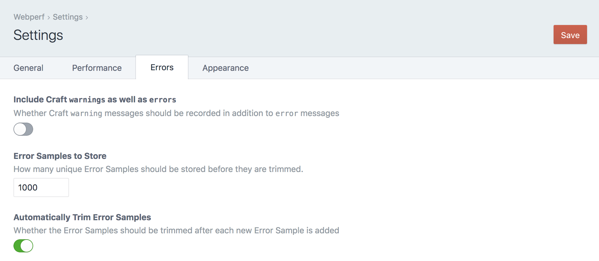

   

# Webperf plugin for Craft CMS 3.x

Webperf helps you build & maintain high quality websites through Real User Measurement of your website's performance

**Note**: _The license fee for this plugin is $99.00 via the Craft Plugin Store._

## This plugin is in development

This plugin isn't finished; don't use it yet. No, really.

## Requirements

This plugin requires Craft CMS 3.0.0 or later.

## Installation

To install the plugin, follow these instructions.

1. Open your terminal and go to your Craft project:

        cd /path/to/project

2. Then tell Composer to load the plugin:

        composer require nystudio107/craft-webperf

3. In the Control Panel, go to Settings → Plugins and click the “Install” button for Webperf

You can also install Webperf via the **Plugin Store** in the Craft Control Panel.

## Webperf Overview

Webperf uses [Real User Measurement](https://en.wikipedia.org/wiki/Real_user_monitoring) (RUM) captured from actual visitors to your website to profile its performance. In this way, Webperf passively gathers and monitors how your website performs on real-world devices used by real-world users.

Webperf also gathers Craft specific information such as database queries, Twig rendering time, memory used, and overall TTFB (Time To First Byte) performance timings. Webperf will also record any front JavaScript errors as well as Craft CMS errors in one place for ease of discovery.

Webperf then presents this performance information in concise graphs that give you insights into how your website performs. Webperf even provides you with bullet-pointed recommendations on how you can fix any performance problems that are found. And [performance affects conversions](https://www.cloudflare.com/learning/performance/more/website-performance-conversion-rates/) as well as user experience.

Webperf leverages the the performance profiling that web browsers & Craft CMS already do. It has been optimized to minimize the [observer effect](https://en.wikipedia.org/wiki/Observer_effect_(physics), collecting data without impacting performance.

Webperf uses the battle-tested [Boomerang](https://akamai.github.io/boomerang/) JavaScript from Akamai, loaded asynchronously in a non-blocking iframe. Boomerang uses performance information from the user's browser via the [Navigation Timing API](https://developer.mozilla.org/en-US/docs/Web/API/Navigation_timing_API).

## Performance Resources

### Making a Craft CMS Website That FLIES Presentation:

* [Making a Craft CMS Website That FLIES slide deck](https://speakerdeck.com/nystudio107/making-a-craft-cms-website-that-flies)

* [A Pretty Website Isn't Enough](https://nystudio107.com/blog/a-pretty-website-isnt-enough)

* [Tags Gone Wild! Managing Tag Managers](https://nystudio107.com/blog/tags-gone-wild)

* [Google: The PRPL Pattern](https://developers.google.com/web/fundamentals/performance/prpl-pattern/)

## Configuring Webperf

As soon as you install Webperf, it automatically will add an asynchronous, non-blocking iframe to your pages that collects performance data. You don't need to add any template code for this to happen.

Once Webperf is installed, it needs to collect performance data samples from users visiting your website. So install it, and sit back and allow it to collect enough data samples to give you a picture of your website's performance.

### General Settings

### Performance Settings

### Errors Settings

### Appearance Settings

## Using Webperf

### Dashboard

#### Overview

#### Recommendations

### Performance

#### Overview

#### Recommendations

#### Detail

### Errors

#### Overview

#### Detail

## Webperf Roadmap

Some things to do, and ideas for potential features:

* Release it

Brought to you by [nystudio107](https://nystudio107.com)
