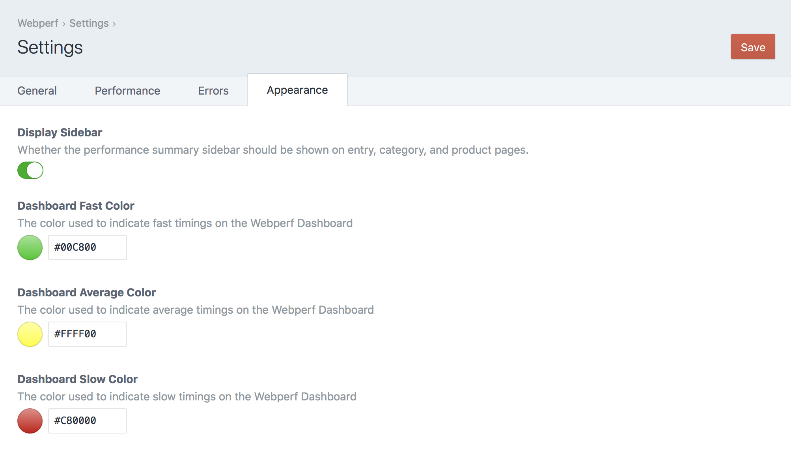
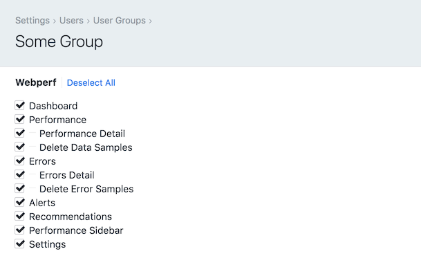

[](https://scrutinizer-ci.com/g/nystudio107/craft-webperf/?branch=v1) [](https://scrutinizer-ci.com/g/nystudio107/craft-webperf/?branch=v1) [](https://scrutinizer-ci.com/g/nystudio107/craft-webperf/build-status/v1) [](https://scrutinizer-ci.com/code-intelligence)

# Webperf plugin for Craft CMS 3.x

Webperf helps you build & maintain high quality websites through Real User Measurement of your website's performance


**Note**: _The license fee for this plugin is $99.00 via the Craft Plugin Store._

## Requirements

This plugin requires Craft CMS 3.0.0 or later.

## Installation

To install the plugin, follow these instructions.

1. Open your terminal and go to your Craft project:

        cd /path/to/project

2. Then tell Composer to load the plugin:

        composer require nystudio107/craft-webperf

3. In the Control Panel, go to Settings → Plugins and click the “Install” button for Webperf

You can also install Webperf via the **Plugin Store** in the Craft Control Panel.

## Webperf Overview

Webperf uses [Real User Measurement](https://en.wikipedia.org/wiki/Real_user_monitoring) (RUM) captured anonymously from actual visitors to your website to profile its performance. In this way, Webperf passively gathers and monitors how your website performs on real-world devices used by real-world users.

Webperf also gathers Craft specific information such as database queries, Twig rendering time, memory used, and overall TTFB (Time To First Byte) performance timings. Webperf will also record any front JavaScript errors as well as Craft CMS errors in one place for ease of discovery.

Webperf then presents this performance information in concise graphs that give you insight into how your website performs. Webperf even provides you with bullet-pointed recommendations on how you can fix any performance problems that are found. And [performance affects conversions](https://www.cloudflare.com/learning/performance/more/website-performance-conversion-rates/) as well as user experience.

Webperf leverages the the performance profiling that web browsers & Craft CMS already do. It has been optimized to minimize the [Observer Effect](https://en.wikipedia.org/wiki/Observer_effect_(information_technology)), collecting data without impacting performance.

Webperf uses the battle-tested [Boomerang](https://akamai.github.io/boomerang/) JavaScript from Akamai, loaded asynchronously in a non-blocking iframe. Boomerang uses performance information from the user's browser via the [Navigation Timing API](https://developer.mozilla.org/en-US/docs/Web/API/Navigation_timing_API).

## Performance Resources

### Making a Craft CMS Website That FLIES Presentation:

[](http://dotall.com/sessions/making-a-craft-cms-website-that-flies)

* [Making a Craft CMS Website That FLIES slide deck](https://speakerdeck.com/nystudio107/making-a-craft-cms-website-that-flies)

* [A Pretty Website Isn't Enough](https://nystudio107.com/blog/a-pretty-website-isnt-enough)

* [Tags Gone Wild! Managing Tag Managers](https://nystudio107.com/blog/tags-gone-wild)

* [Google: The PRPL Pattern](https://developers.google.com/web/fundamentals/performance/prpl-pattern/)

## GDPR & Privacy

The performance and error statistics that Webperf records contain no user identifiable information. No IP addresses are recorded, and the samples are anonymous.

## Configuring Webperf

As soon as you install Webperf, it automatically will add an asynchronous, non-blocking iframe to your pages that collects anonymous performance data. You don't need to add any template code for this to happen.

Once Webperf is installed, it needs to collect performance data samples from users visiting your website. So install it, and sit back and allow it to collect enough data samples to give you a picture of your website's performance.

### General Settings


 * **Plugin name** - The public-facing name of the plugin
 * **Include Browser Beacon** - Whether or not the asynchronous User Timing Beacon should be rendered on frontend pages.
 * **Include Craft Beacon** - Whether or not the Craft profiling data should be recorded for site requests.
 * **Static Cached Site** - If the site is static cached, turn this option on to prevent Webperf from generating a unique beacon token.
 * **WebPageTest.org API Key** - To run pages through [WebPageTest.org](https://www.webpagetest.org/) via an API, you need an API key. Enter your WebpageTest.org API key here. If you don't have one, they are free and easy to obtain. [Learn More](https://www.webpagetest.org/getkey.php)
 * **Exclude Patterns** - [Regular expressions](https://regexr.com/) to match URLs that should be excluded from tracking.

### Performance Settings


 * **Webperf Data Samples to Store** - How many unique Webperf Data Samples should be stored before they are trimmed.
 * **Automatically Trim Data Samples** - Whether the Data Samples should be trimmed after each new Data Sample is added
 * **Trim Outlier Data Samples** - Whether outlier data samples that are `10x` the mean should be deleted
 * **Rate Limit in ms** - The number of milliseconds required between recording of frontend beacon data samples.

### Errors Settings


 * **Include Craft `warnings` as well as `errors`** - Whether Craft `warning` messages should be recorded in addition to error messages
 * **Error Samples to Store** - How many unique Error Samples should be stored before they are trimmed.
 * **Automatically Trim Error Samples** - Whether the Error Samples should be trimmed after each new Error Sample is added

### Appearance Settings



 * **Display Sidebar** - Whether the performance summary sidebar should be shown on entry, category, and product pages.
 * **Dashboard Fast Color** - The color used to indicate fast timings on the Webperf Dashboard. Defaults to `#00c800`
 * **Dashboard Average Color** - The color used to indicate average timings on the Webperf Dashboard. Defaults to `#ffff00`
 * **Dashboard Slow Color** - The color used to indicate slow timings on the Webperf Dashboard. Defaults to `#c80000`

### User Permissions



You can control access to various Webperf settings and functions on a per-user group basis. Go to Settings → Users → User Groups to edit your use groups settings:

* **Dashboard** - Access to the Webperf Dashboard page
* **Performance** - Access to the Webperf Performance page
* **Performance Detail** - Access to the Webperf Performance Detail page
* **Delete Data Samples** - The ability to delete performance data samples
* **Errors** - Access to the Webperf Errors page
* **Errors Detail** - Access to the Webperf Errors Detail page
* **Delete Error Samples** - The ability to delete error samples
* **Recommendations** - The ability to see the Recommendations on the Dashboard & Performance pages
* **Performance Sidebar** - Whether the performance summary sidebar should be shown on entry, category, and product pages
* **Settings** - Access to the Webperf settings page

Ensure that you've also enabled plugin access to the Webperf plugin as well for any user groups you want to grant access to Webperf.

## Using Webperf

Webperf is a passive Real User Measurement system that extracts the performance that people experience when they visit your website. Since devices, connections, and Internet conditions vary, the more people visit your website, the better overall performance picture you'll have.

Webperf shows a warning ⚠ next to any metric that is composed of fewer than 100 samples, because there may not be enough data for it to be statistically significant.

If you are using a multi-site setup, on all of Webperf's pages there will be a site switcher that lets you choose between viewing data for all sites, or for a specific site alone.

### Dashboard

#### Overview


The Webperf Dashboard gives you an overall picture of how all of the pages on your site perform.

#### Browser Performance


#### Recommendations


### Performance

#### Overview


#### Recommendations


#### Detail


### Errors

#### Overview


#### Detail


### Sidebar


### Twig Templating

To disable the inclusion of the frontend user timing beacon on a particular template, you can do:

```twig

```

To disable the inclusion of the Craft timing beacon on a particular template, you can do:

```twig

```

For Google AMP pages, you can signal to Webperf to use an AMP HTML beacon via:

```twig

```

### Console Command

Retour has a built-in `webperf/samples/trim` console command that allows you to manually trim the `webperf_data_samples` and `webperf_error_samples` tables:

```bash
vagrant@homestead ~/sites/craft3 $ ./craft webperf/samples/trim
Trimming data samples
Trimmed 0 from webperf_data_samples table
Trimming error samples
Trimmed 0 from webperf_error_samples table
```

This will trim the `webperf_data_samples` table so that it has only the number of samples in the table as you've specified via the **Webperf Data Samples to Store** Setting.

This will also trim the `webperf_error_samples` table so that it has only the number of samples in the table as you've specified via the **Error Samples to Store** Setting.

When the tables are trimmed, it sorts the samples by the **Date Created** time, and only trims the oldest samples.

Normally this is done automatically when a new data sample or error sample is recored, but for high traffic sites that are constantly hit by bots, you might want to do it manually at regular intervals.

You can also pass in an optional `--limit` to override the **Webperf Data Samples to Store** Setting, and trim to a specified number of statistics:

```bash
vagrant@homestead ~/sites/craft3 $ ./craft webperf/samples/trim --limit=1
Trimming data samples
Trimmed 503 from webperf_data_samples table
Trimming error samples
Trimmed 22 from webperf_error_samples table
```

### Events

Webperf throws several events, in case you want to listen for them in your custom plugin/module, or use them in conjunction with the [Webhooks](https://github.com/craftcms/webhooks) plugin.

`beforeSaveDataSample` The event that is triggered before the data sample is saved.  You may set [[DataSampleEvent::isValid]] to `false` to prevent the data sample from getting saved.

```php
use nystudio107\webperf\services\DataSamples;
use nystudio107\webperf\events\DataSampleEvent;

Event::on(DataSamples::class,
    DataSamples::EVENT_BEFORE_SAVE_DATA_SAMPLE,
    function(DataSampleEvent $event) {
        // potentially set $event->isValid;
    }
);
```

`afterSaveDataSample` The event that is triggered after the redirect is saved

```php
use nystudio107\webperf\services\DataSamples;
use nystudio107\webperf\events\DataSampleEvent;

Event::on(DataSamples::class,
    DataSamples::EVENT_AFTER_SAVE_DATA_SAMPLE,
    function(DataSampleEvent $event) {
        // the data sample was saved
    }
);
```

`beforeSaveErrorSample` The event that is triggered before the error sample is saved. You may set [[ErrorSampleEvent::isValid]] to `false` to prevent the error sample from getting saved.

```php
use nystudio107\webperf\services\ErrorSamples;
use nystudio107\retour\events\ErrorSampleEvent;

Event::on(ErrorSamples::class,
    ErrorSamples::EVENT_BEFORE_SAVE_ERROR_SAMPLE,
    function(ErrorSampleEvent $event) {
        // potentially set $event->isValid;
    }
);
```

`afterSaveErrorSample` The event that is triggered after the redirect is saved

```php
use nystudio107\webperf\services\ErrorSamples;
use nystudio107\webperf\events\ErrorSampleEvent;

Event::on(ErrorSamples::class,
    ErrorSamples::EVENT_AFTER_SAVE_ERROR_SAMPLE,
    function(ErrorSampleEvent $event) {
        // the error sample was saved
    }
);
```

## Webperf Roadmap

Some things to do, and ideas for potential features:

* User definable "Alerts" that can be consumed by the Webhooks plugin
* Have the Recommendations be a type of "Alert"
* Comparison of multiple periods side by side to show comparative performance

Brought to you by [nystudio107](https://nystudio107.com)
