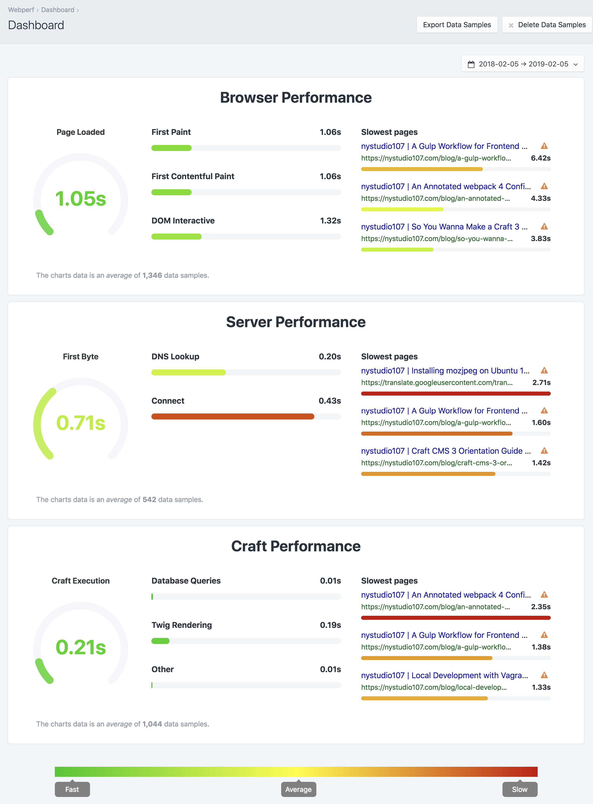
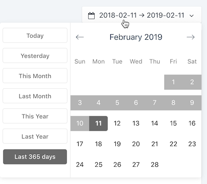
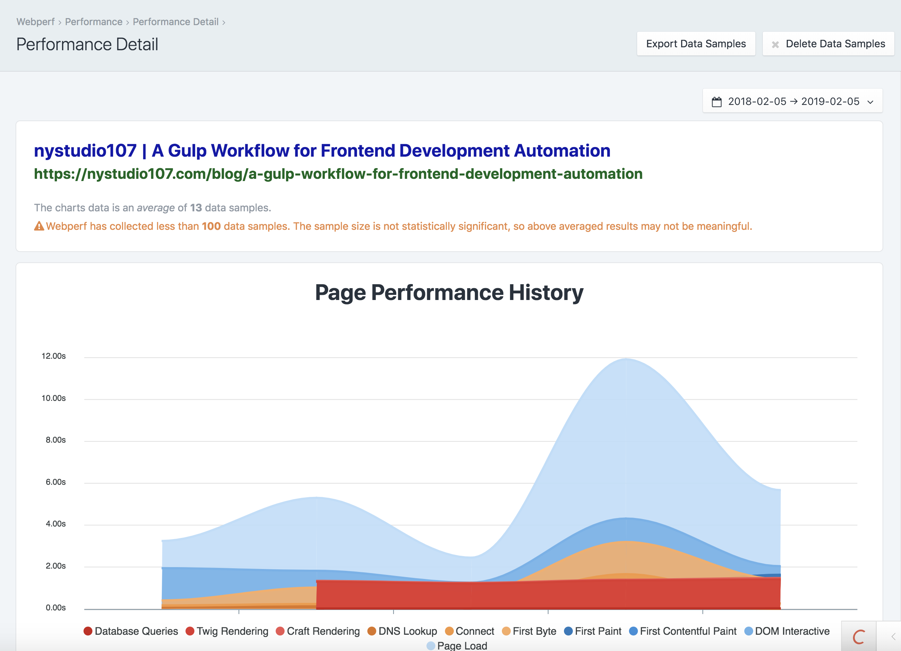
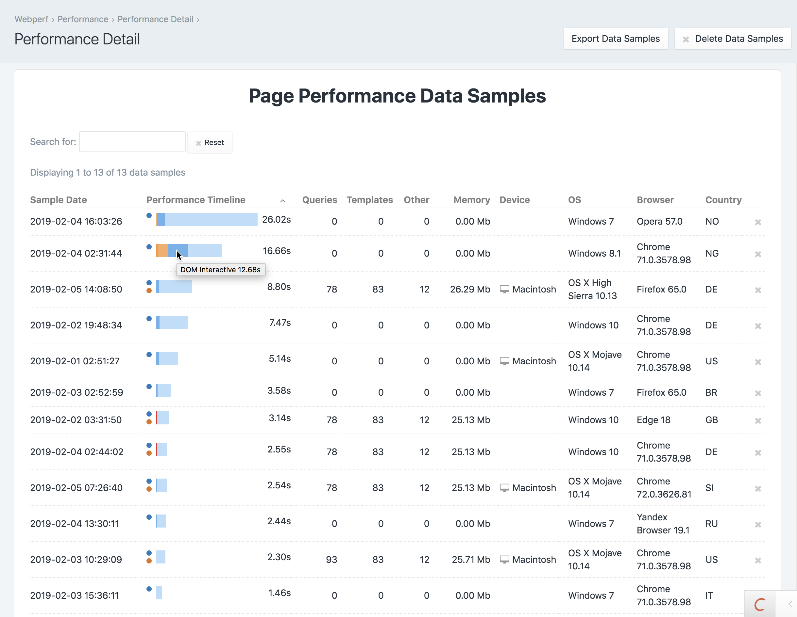
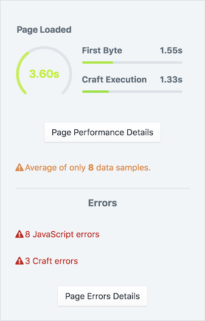

# Using Webperf

Webperf is a passive Real User Measurement system that extracts the performance that people experience when they visit your website. Since devices, connections, and Internet conditions vary, the more people visit your website, the better overall performance picture you'll have.

Webperf shows a warning ⚠ next to any metric that is composed of fewer than 100 samples, because there may not be enough data for it to be statistically significant.

If you are using a multi-site setup, on all of Webperf's pages there will be a site switcher that lets you choose between viewing data for all sites, or for a specific site alone.

## Dashboard

### Overview



The Webperf Dashboard gives you an overall picture of how all of the pages on your site perform. The statistics displayed here are an aggregate of all of the performance timings from all of your site's pages.



You can also choose the date range on any page to control what data samples you're viewing.

### Browser Performance

* **Page Loaded** - The time it takes for the webpage to be fully loaded in the client's browser. [Learn More](https://developers.google.com/web/fundamentals/performance/speed-tools/)
* **First Paint** - When the browser first begins to nominally paint content into the browser. [Learn More](https://developers.google.com/web/tools/lighthouse/audits/first-meaningful-paint)
* **First Contentful Paint** - The first meaningful content that the client sees 'painted' in their browser. [Learn More](https://developers.google.com/web/tools/lighthouse/audits/first-contentful-paint)
* **Slowest Pages** - The slowest pages based on the **Page Loaded** statistic

### Server Performance

* **First Byte** - How long it takes before the first byte of data is received from the server. [Learn More](https://developers.google.com/web/tools/chrome-devtools/network-performance/understanding-resource-timing)
* **DNS Lookup** - How long it takes to do a DNS lookup of the website's IP address. [Learn More](https://developers.google.com/web/tools/chrome-devtools/network-performance/understanding-resource-timing)
* **Connect** - How long it takes to negotiate a connection to the server. [Learn More](https://developers.google.com/web/tools/chrome-devtools/network-performance/understanding-resource-timing)
* **Slowest Pages** - The slowest pages based on the **First Byte** statistic

### Craft Performance

* **Craft Execution** - The total amount of time it takes Craft to process the webpages. [Learn More](https://nystudio107.com/blog/profiling-your-website-with-craft-cms-3s-debug-toolbar)
* **Database Queries** - How long it takes to execute the database queries for the webpages. [Learn More](https://nystudio107.com/blog/profiling-your-website-with-craft-cms-3s-debug-toolbar)
* **Twig Rendering** - How long it takes Twig to render the templates for the webpages. [Learn More](https://nystudio107.com/blog/profiling-your-website-with-craft-cms-3s-debug-toolbar)
* **Other** - Other profiled code (such as from plugins) in order to process the webpages. [Learn More](https://nystudio107.com/blog/profiling-your-website-with-craft-cms-3s-debug-toolbar)
* **Slowest Pages** - The slowest pages based on the **Craft Execution** statistic

### Recommendations


Webperf will provide you with a list of recommendations of things that you can do to improve the performance of your website. It also includes links to resources where you can learn more about the topic.

## Performance

### Overview


The Performance section gives you a stacked area graph of the aggregate performance history of your website. You can mouse over the graph for data point details.


The Performance section also gives you a table initially sorted by **Performance Timeline** that shows you the aggregate performance of your pages.

You can limit what is displayed in the table by typing what you're looking for in the **Search for:** field, and you can sort the table by any of the columns by clicking on them.

The **Performance Timeline** is a graphical depiction of the measured stages of the page load. You can mouse over each section of the bar graph to see the statistic in question.

Webperf does both frontend browser performance timings, as well as backend Craft performance timings. A blue dot next to the **Performance Timeline** indicates a frontend timing, an orange dot means a backend Craft timing, and both means a combined frontend/backend sample.

Click on any row in the Performance table to go to a Performance Detail page for that particular webpage.

### Performance Detail



The chart on the Performance Detail page shows you the performance history of one particular page. You can mouse over the graph to see the details of each sample in the graph.


The Performance Detail page also gives you the same charts as the Dashboard, but for this particular page. It also provides buttons to launch more detailed performance tests via the third party websites Google PageSpeed Insights, WebpageTest.org, and GTMetrix.com.


The Performance Detail page will also give you a list of recommendations of things that you can do to improve the performance of this particular page. It also includes links to resources where you can learn more about the topic.



For the Performance Detail page, you can also see each individual anonymous Real User Measurement timing that was taken for this particular page.

The table is fully searchable and sortable, and will give you details on each vistor and the experience they had loading the page.

## Errors

Webperf will record both frontend JavaScript errors, as well as backend Craft errors in one place to make it easy to see where things go wrong.

### Overview


The Aggregate Page Errors History chart shows you the history of errors for all of your pages on your website. Craft errors are in red, and JavaScript errors are in green.


The Aggregate Page Errors table lists all of the pages that have errors logged. The table is full searchable and sortable by clicking on the column headings.

Click on any row in the table to go to see the errors for a specific page.

### Errors Detail


The Page Error History chart shows you the errors for this particular page. You can mouse over the chart for details on a given error sample.


The Page Errors Detail table gives you a detailed list of the JavaScript and Craft errors for a given page, the date they occurred, and some details of the browser that was being used when the errors was thrown.

## Sidebar



Webperf includes a Performance Sidebar that is displayed when editing an Entry, Category, or Product. You can control whether this sidebar appears, and for which user groups via Permissions.

## Twig Templating

To disable the inclusion of the frontend user timing beacon on a particular template, you can do:

```twig

```

To disable the inclusion of the Craft timing beacon on a particular template, you can do:

```twig

```

For Google AMP pages, you can signal to Webperf to use an AMP HTML beacon via:

```twig

```

## Console Command

Retour has a built-in `webperf/samples/trim` console command that allows you to manually trim the `webperf_data_samples` and `webperf_error_samples` tables:

```bash
vagrant@homestead ~/sites/craft3 $ ./craft webperf/samples/trim
Trimming data samples
Trimmed 0 from webperf_data_samples table
Trimming error samples
Trimmed 0 from webperf_error_samples table
```

This will trim the `webperf_data_samples` table so that it has only the number of samples in the table as you've specified via the **Webperf Data Samples to Store** Setting.

This will also trim the `webperf_error_samples` table so that it has only the number of samples in the table as you've specified via the **Error Samples to Store** Setting.

When the tables are trimmed, it sorts the samples by the **Date Created** time, and only trims the oldest samples.

Normally this is done automatically when a new data sample or error sample is recored, but for high traffic sites that are constantly hit by bots, you might want to do it manually at regular intervals.

You can also pass in an optional `--limit` to override the **Webperf Data Samples to Store** Setting, and trim to a specified number of statistics:

```bash
vagrant@homestead ~/sites/craft3 $ ./craft webperf/samples/trim --limit=1
Trimming data samples
Trimmed 503 from webperf_data_samples table
Trimming error samples
Trimmed 22 from webperf_error_samples table
```

## Events

Webperf throws several events, in case you want to listen for them in your custom plugin/module, or use them in conjunction with the [Webhooks](https://github.com/craftcms/webhooks) plugin.

`beforeSaveDataSample` The event that is triggered before the data sample is saved.  You may set [[DataSampleEvent::isValid]] to `false` to prevent the data sample from getting saved.

```php
use nystudio107\webperf\services\DataSamples;
use nystudio107\webperf\events\DataSampleEvent;

Event::on(DataSamples::class,
    DataSamples::EVENT_BEFORE_SAVE_DATA_SAMPLE,
    function(DataSampleEvent $event) {
        // potentially set $event->isValid;
    }
);
```

`afterSaveDataSample` The event that is triggered after the redirect is saved

```php
use nystudio107\webperf\services\DataSamples;
use nystudio107\webperf\events\DataSampleEvent;

Event::on(DataSamples::class,
    DataSamples::EVENT_AFTER_SAVE_DATA_SAMPLE,
    function(DataSampleEvent $event) {
        // the data sample was saved
    }
);
```

`beforeSaveErrorSample` The event that is triggered before the error sample is saved. You may set [[ErrorSampleEvent::isValid]] to `false` to prevent the error sample from getting saved.

```php
use nystudio107\webperf\services\ErrorSamples;
use nystudio107\retour\events\ErrorSampleEvent;

Event::on(ErrorSamples::class,
    ErrorSamples::EVENT_BEFORE_SAVE_ERROR_SAMPLE,
    function(ErrorSampleEvent $event) {
        // potentially set $event->isValid;
    }
);
```

`afterSaveErrorSample` The event that is triggered after the redirect is saved

```php
use nystudio107\webperf\services\ErrorSamples;
use nystudio107\webperf\events\ErrorSampleEvent;

Event::on(ErrorSamples::class,
    ErrorSamples::EVENT_AFTER_SAVE_ERROR_SAMPLE,
    function(ErrorSampleEvent $event) {
        // the error sample was saved
    }
);
```

Brought to you by [nystudio107](https://nystudio107.com)
