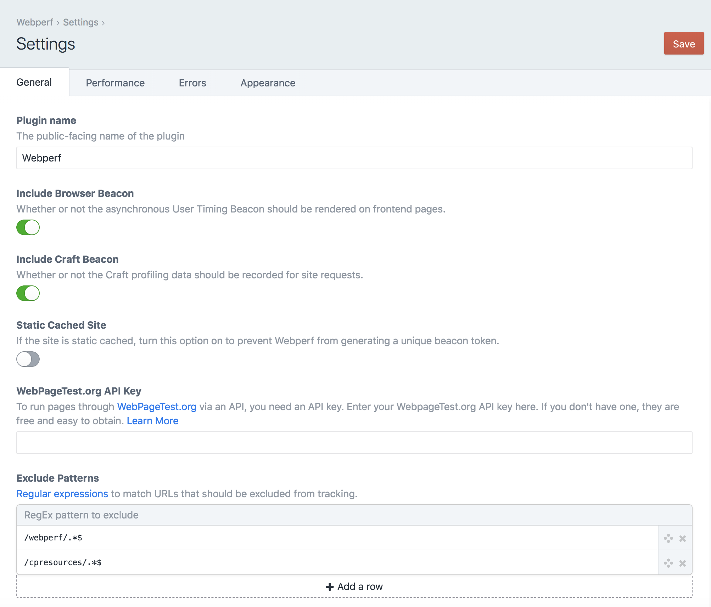
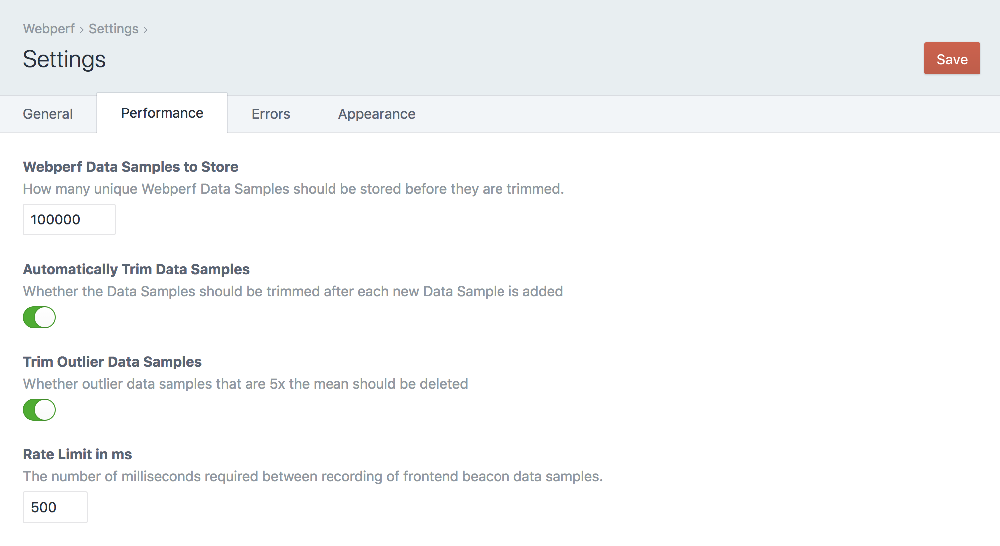
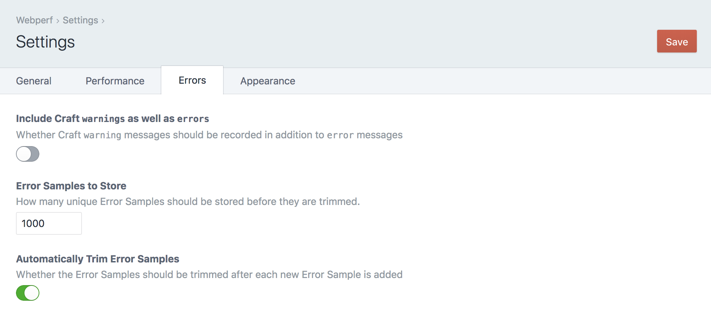
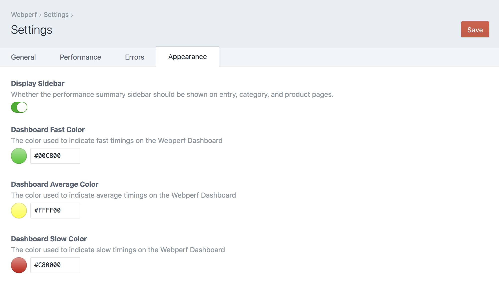
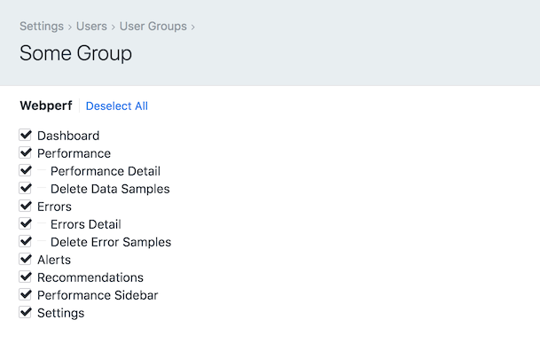

# Configuring Webperf

As soon as you install Webperf, it automatically will add an asynchronous, non-blocking iframe to your pages that collects anonymous performance data. You don’t need to add any template code for this to happen.

Once Webperf is installed, it needs to collect performance data samples from users visiting your site. So install it, and sit back and allow it to collect enough data samples to give you a picture of your website’s performance.

In case you are statically caching pages on your website, they will need to be purged in order for the Webperf iframe to be added to your code. This only needs to happen when Webperf is first installed.

## Minify

If you have the [Minify](https://plugins.craftcms.com/minify) plugin installed, the JavaScript that loads the beacon will be automatically minified for you.

## General Settings

 * **Plugin name** - The public-facing name of the plugin
 * **Include Browser Beacon** - Whether or not the asynchronous User Timing Beacon should be rendered on frontend pages.
 * **Include Craft Beacon** - Whether or not the Craft profiling data should be recorded for site requests.
 * **Static Cached Site** - If the site is static cached, turn this option on to prevent Webperf from generating a unique beacon token.
 * **WebPageTest.org API Key** - To run pages through [WebPageTest.org](https://www.webpagetest.org/) via an API, you need an API key. Enter your WebpageTest.org API key here. If you don’t have one, they are free and easy to obtain. [Learn More](https://www.webpagetest.org/getkey.php)
 * **Exclude Patterns** - [Regular expressions](https://regexr.com/) to match URLs that should be excluded from tracking.

## Performance Settings

 * **Webperf Data Samples to Store** - How many unique Webperf Data Samples should be stored before they are trimmed.
 * **Automatically Trim Data Samples** - Whether the Data Samples should be trimmed after each new Data Sample is added
 * **Trim Outlier Data Samples** - Whether outlier data samples that are `10x` the mean should be deleted
 * **Rate Limit in ms** - The number of milliseconds required between recording of frontend beacon data samples.

## Errors Settings

 * **Include Craft `warnings` as well as `errors`** - Whether Craft `warning` messages should be recorded in addition to error messages
 * **Error Samples to Store** - How many unique Error Samples should be stored before they are trimmed.
 * **Automatically Trim Error Samples** - Whether the Error Samples should be trimmed after each new Error Sample is added

## Appearance Settings

 * **Display Sidebar** - Whether the performance summary sidebar should be shown on entry, category, and product pages.
 * **Dashboard Fast Color** - The color used to indicate fast timings on the Webperf Dashboard. Defaults to `#00c800`
 * **Dashboard Average Color** - The color used to indicate average timings on the Webperf Dashboard. Defaults to `#ffff00`
 * **Dashboard Slow Color** - The color used to indicate slow timings on the Webperf Dashboard. Defaults to `#c80000`

## User Permissions

You can control access to various Webperf settings and functions on a per-user group basis. Go to Settings → Users → User Groups to edit your use groups settings:

* **Dashboard** - Access to the Webperf Dashboard page
* **Performance** - Access to the Webperf Performance page
* **Performance Detail** - Access to the Webperf Performance Detail page
* **Delete Data Samples** - The ability to delete performance data samples
* **Errors** - Access to the Webperf Errors page
* **Errors Detail** - Access to the Webperf Errors Detail page
* **Delete Error Samples** - The ability to delete error samples
* **Recommendations** - The ability to see the Recommendations on the Dashboard & Performance pages
* **Performance Sidebar** - Whether the performance summary sidebar should be shown on entry, category, and product pages
* **Settings** - Access to the Webperf settings page

Ensure that you’ve also enabled plugin access to the Webperf plugin as well for any user groups you want to grant access to Webperf.

Brought to you by [nystudio107](https://nystudio107.com)
